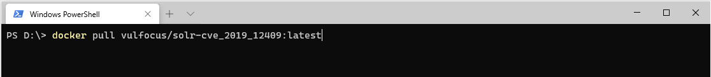
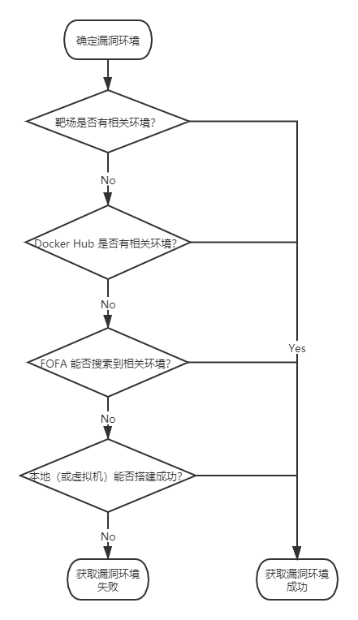

# 如何快速获取漏洞环境

## 0x00 前言

当复现、分析漏洞的时候，我们首先需要完成的前提工作是找到可利用的漏洞环境。当我们有了可利用的漏洞环境之后既可以快速测试自己写的或者从网络上获取的漏洞检测脚本是否有效，也可以进一步调试程序从而分析漏洞原理，所以说获取漏洞环境可以说是漏洞研究的前提。目前找到漏洞环境的方法大概有以下几种：漏洞环境靶场、Docker Hub 拉取镜像、网络空间搜索引擎搜索、本地搭建、虚拟机搭建。这几种方法都有各自的特点，每种方法都有各自的优缺点，我们可以根据实际情况选择。下面我们对这几种方法进行简单的分析，并且说明一下每种方法的使用方法。

## 0x01 获取漏洞环境方法的介绍

### 漏洞环境靶场

为了让安全研究人员更快速的获取漏洞环境、更方便的研究漏洞，目前已有一些靶场专门收集漏洞环境以供安全研究人员使用，例如国内的 vulhub、vulfocus，国外的 vulnhub 等等。使用这些靶场往往只需要一条命令或者简单的操作就可以获取到漏洞环境，我们只需要按照靶场的使用说明就可以比较轻松的获取到靶场已提供的漏洞环境。使用这种方法的好处是方便快速，不需要我们去折腾漏洞环境的搭建，靶场已经帮我们隐藏掉了漏洞环境的配置细节，开箱即用；当然使用靶场也是有缺点的，一是获取到的漏洞环境一般不在本地所以我们很难对漏洞环境进行调试，二是靶场所提供的漏洞环境一般都是有限的，靶场的数量和更新速度可能并不能满足你的需求。总结一下就是，使用靶场获取漏洞环境的方法比较适合复现漏洞、测试 `Poc&Exp` 是否可用、对安全工作者的考核或者 `CTF` 等等。

vulhub 使用方法说明：下载 vulhub，在相应漏洞环境目录执行 `docker-compose up -d` 即可。

vulfocus 使用方法说明：访问 `vulfocus.fofa.so` 启动相应漏洞环境即可。

优点：简单、快速、无需配置

缺点：靶场环境有限

难度：⭐

推荐指数：⭐⭐⭐⭐⭐

### Docker Hub 拉取漏洞环境镜像

随着容器技术的发展，目前 Docker 已经被大范围地运用到了生产环境中，很多软件也在 Docker Hub 中存在着不同版本的镜像。每个漏洞都会有对应的软件版本，那么作为安全研究人员可以安装 Docker 从 Docker Hub 拉取所需要的镜像在本地运行来搭建相应的漏洞环境。此外，很多安全研究人员也开始使用 Docker 来搭建自己的漏洞环境，比如前文提到的漏洞靶场 vulhub、vulfocus 都是基于 Docker 来搭建的。我们在 Docker Hub 发现了新的漏洞环境或者我们自己从 Dockerfile build 的新漏洞环境除了自己使用也可以贡献给社区。使用这种方法的特点和使用靶场类似，相比靶场的一点好处是 Docker Hub 上面的软件更多、版本也更丰富，所以漏洞环境相比靶场来说也更丰富；相比靶场的一点缺点是从 Docker Hub 拉回来的镜像有时需要我们进行简单的配置或者容器间配合启动，相比靶场会操作复杂一些。

Docker Hub 拉取漏洞环境说明：在 Docker Hub 搜索相应漏洞环境或者相应版本的软件，选择镜像的标签后拉取镜像。

优点：相对简单、相比靶场漏洞环境更丰富

缺点：需要一点命令行和容器基础知识

难度：⭐

推荐指数：⭐⭐⭐⭐⭐

### 网络空间搜索引擎搜索漏洞环境

随着网络资产管理、网络空间搜索的概念被重视，相应的产品也逐渐成熟，例如国内的 FOFA、ZoomEye 和国外的 Shodan 等等。使用这些网络空间搜索引擎可以快速地获取运行某软件的服务器 IP 地址、端口和其他信息。当新的漏洞被披露之后，我们一般会使用这些搜索引擎搜索该漏洞影响的软件，从而从结果中获取该漏洞在全球的大致影响范围。那么如果我们想要获取实际的漏洞环境也可以使用这些网络空间搜索引擎的相应语法进行搜索来查找目标。这种方法的优点是可以快速获取大量真实的漏洞目标；但是缺点也很明显，如果对这些真实目标进行测试可能会对目标业务造成一定的影响。使用这种方式的另一个缺点就是目前的网络空间搜索引擎一般并不支持对版本的搜索，所以我们并不能精确地搜索到漏洞对应软件的正确版本。

FOFA 使用简介：搜索运行 WebLogic 中间件的主机。

优点：简单、可获取大量真实的目标

缺点：如果对真实目标测试，有一定的法律风险

难度：⭐

推荐指数：⭐⭐⭐⭐

### 本地搭建漏洞环境

使用前两种方法，我们可以非常方便快速地搭建起漏洞环境。但是由于前两种方法都是使用别人提供好的漏洞环境，所以漏洞环境不会很全，有些漏洞环境在靶场或者 Docker Hub 会找不到。当想要的漏洞环境找不到的时候，我们只能选择自己本地搭建漏洞环境了。这种方法需要我们做的事情就比较多了，需要我们下载存在漏洞的相应版本的软件进行配置、运行。这个过程就会比较费时间，需要我们去下载、去配置，不过我们还是可以借助一些集成工具简化这个过程的，例如 PHPStudy、XAMPP 等等。使用集成工具搭建漏洞环境可以帮助我们省去安装配置一些基础软件，例如使用 PHPStudy 就可以帮助我们安装配置好 Apache、MySQL、PHP 等软件，我们只需要将需要运行的 Web 网站部署到指定位置即可。使用这种方式搭建漏洞环境的缺点已经很明显了，就是费时、步骤繁琐；但是使用这种方式的优点也比较明显，因为环境在本地我们可以更详细地分析漏洞原理，更方便我们去调试程序。

PHPStudy 的使用简介：在控制面板启动相应软件，部署好 Web 网站即可。

优点：漏洞环境在本地，可以更方便地分析、调试程序

缺点：搭建漏洞环境费时、步骤繁琐

难度：⭐⭐⭐

推荐指数：⭐⭐⭐

### 虚拟机搭建漏洞环境

使用虚拟机搭建漏洞环境和本地搭建漏洞环境的方式相似，差别在于我们需要安装 VMware、VirtualBox 等虚拟化软件，然后在安装好的虚拟机中搭建漏洞环境。这种方式可以说是本地搭建漏洞环境的方法的补充。这种方法相较于本地搭建漏洞环境的优点是在虚拟机搭建不会影响自己本地的系统，不用担心搭建漏洞环境对自己本地电脑的影响；另外一点好处就是，虚拟机文件可以打包进行分享，比如前面提到的 vulnhub 就是使用这种方法搭建的漏洞环境并且将虚拟机文件进行分享；使用这种方法的缺点就是，因为虚拟机文件占用的硬盘空间很大导致打包共享的漏洞环境也会很大，上传下载比较浪费时间。

优点：相较于本地搭建漏洞环境，不会对本地环境造成影响；可以对虚拟机打包进行共享

缺点：需要安装 VMware、VirtualBox 等虚拟化软件，在虚拟机中搭建漏洞环境，费时、步骤繁杂；虚拟机文件比较大，共享不方便

难度：⭐⭐⭐

推荐指数：⭐⭐⭐

## 0x02 总结

前面介绍获取漏洞环境方法的顺序，大致也是我平时寻找漏洞环境的流程，如下图：

作为研究漏洞的前提，漏洞环境的获取相对来说是一个不让人那么重视的问题，这篇文章主要将我自己在寻找漏洞环境时所用的方法总结了一下。总的来说，获取漏洞环境的方法有很多，但是每种方法都有各自的优缺点，我们应该在特定的场景选择合适的方法搭建漏洞环境。在搭建好漏洞环境之后，我们就可以愉快地进行之后的操作了，或复现漏洞或漏洞调试。在之后的文章中，我会继续讨论有关漏洞环境的获取和漏洞的 `PoC&Exp` 编写相关的内容，欢迎大家关注 :-)。

## Reference

- [Vulhub](https://github.com/vulhub/vulhub)
- [Vulfocus](https://github.com/fofapro/vulfocus)
- [vulnhub](https://www.vulnhub.com/)
- [FOFA](https://fofa.so)
- [PHPStudy](https://www.xp.cn/)