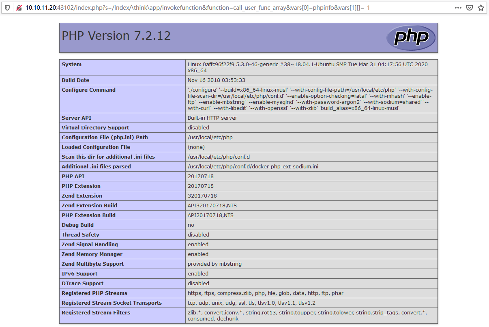
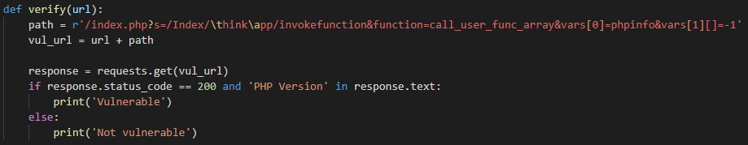
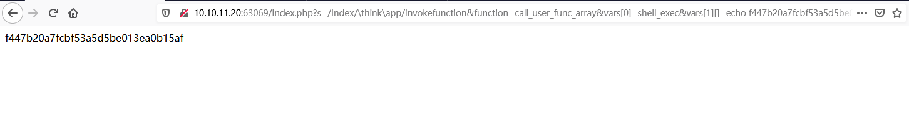
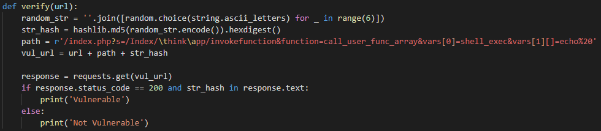
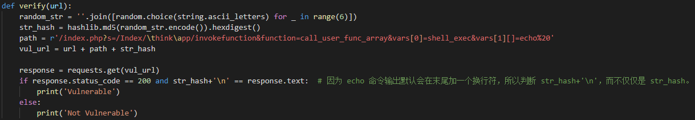
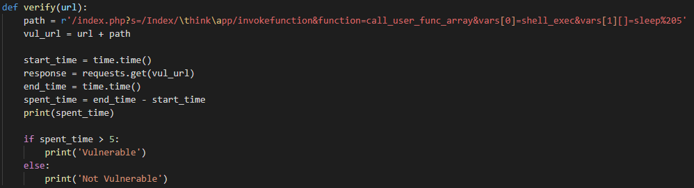
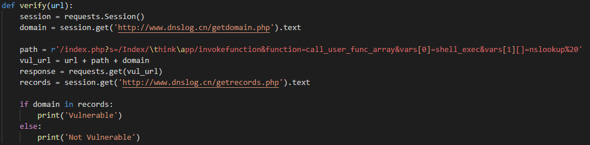

# RCE 漏洞的验证

## 0x00 前言

当一个漏洞被披露之后，作为安全研究人员需要做的事情大概有漏洞分析、漏洞验证代码编写、漏洞利用代码编写三部分。漏洞分析就是分析被披露漏洞的原理，分析该漏洞的触发位置、该漏洞在什么条件下会被触发；在分析完漏洞原理之后，就需要将分析过程转化为自动验证漏洞的代码用于应急响应时的批量化漏洞检测；漏洞利用代码需要做的当然就是利用漏洞，把漏洞的危害尽可能大地体现出来。

因为最近一段时间可能会做一些 `RCE` 漏洞的 `PoC` 和 `Exp` 编写，所以就想先把 `RCE` 漏洞相关的验证和利用方法整理一下，也算是为之后的工作做下准备。

## 0x01 漏洞分类

当谈到漏洞分类的时候，我们大多时候先想到的应该是 Web 漏洞、中间件漏洞、二进制漏洞等等这些分类。我们以漏洞出现的位置或漏洞的原理将漏洞进行分类当然没有问题，我们分类的标准不同自然就会得到不同的分类。但是当我们在谈论到漏洞的验证和利用的时候，更常用的分类是漏洞被触发后是否有结果回显这两类。因为当漏洞被触发后，只有我们能看到或不能看到漏洞触发效果这两种情况。比如说，我们通过某一个 `RCE` 漏洞执行了一条 `whoami` 命令，那么结果只有两种——一种情况是我们在页面上直观地看到了命令执行后的结果；一种是命令确实执行了，但是我们在页面上看不到执行结果。所以，我们根据漏洞被触发后结果的显示形式将漏洞分为了**有回显的漏洞**和**无回显的漏洞**。针对这两种类型的漏洞，我们都有相应的验证和利用方法。

## 0x02 RCE 漏洞的验证

关于漏洞验证时需要注意的点，已经有很多文章在写了，大概有以下注意点：**随机性**、**确定性**、**通用性**、**无害性**等等。

> - 随机性：`Payload` 中不要出现一些固定的字符或者有关个人、公司的信息，尽量使用一些随机字符来进行检测，例如一段随机字符串、一段随机字符串的 `Hash` 值等等。
> - 确定性：`PoC` 要能够从响应数据包中通过唯一确定的标识来判断漏洞是否存在，例如通过一段随机字符串的 `Hash` 值就比用简单的 `admin` 字符串好得多，因为 `admin` 字符串太常见了，可能漏洞不存在时响应数据包中也会出现 `admin` 字符串。
> - 通用性：`PoC` 要尽可能地使用跨平台的操作，以达到一个 `PoC` 可以检测 Linux、Window 等尽可能多平台的漏洞的目的。
> - 无害性：`PoC` 在对目标进行漏洞验证的时候，要尽量使用一些无害、无副作用的操作，一定不能对目标有不可逆的损坏。

关于 `RCE` 漏洞的验证，我们将分为有回显漏洞的验证和无回显漏洞的验证两部分总结。

### 有回显 RCE 漏洞的验证

有回显的漏洞在被触发后，漏洞的执行结果将会被返回到前端页面，所以我们可以直观地通过前端的结果来判断漏洞是否被触发了，自然也就验证了漏洞是否存在。我们可以以 ThinkPHP 5.x 版本的 `RCE` 漏洞来举个例。

我们可以先看一下 ThinkPHP 5.x 版本的 PoC：

> `http://ip:port/index.php?s=/Index/\think\app/invokefunction&function=call_user_func_array&vars[0]=phpinfo&vars[1][]=-1`
>
> 执行结果如下：
>
> 

我们可以从前端页面返回结果很直观地看到，`phpinfo` 函数被执行了，那我们该如何编写脚本进行自动化检测呢？我们可以先看下我写的一个检测方法，然后挑出来毛病。

  

这个脚本里我们使用 `PHP Version` 这个字符串进行判断，响应包状态码 `200` 且包含 `PHP Version` 字符串则认为漏洞存在，否则认为漏洞不存在。对于我们这个特定的存在漏洞的 ThinkPHP 5.x 目标来说这样写是可以的，但是我们如果对其它非 ThinkPHP 5.x 目标检测会怎么样呢？根据代码来看，只要响应包状态码是 `200` 且包含 `PHP Verison` 字符串即可认为漏洞存在，那么如果我们请求了一个 `Java` 站点然后恰巧响应包状态码是 `200` 且包含 `PHP Version` 字符串呢？很明显脚本会判断漏洞存在，这样就发生的误报。当扫描目标数量庞大的时候，这种误报是十分麻烦的。这里就违反了 `PoC` 准则的确定性，我们并不能有唯一确定的条件来判断漏洞是否存在且没有误报。关于这个脚本，我认为它也违反了 `PoC` 准则的无害性，因为我们执行了 `phpinfo` 函数就可以从相应包中提取服务器的状态信息。虽然我们没有在脚本中获取服务器状态信息，但是目标服务器会在日志中记录下请求信息，这样从日志来看就会判断我们获取了 `phpinfo` 函数的执行结果，对方就有理由说我们非法获取服务器信息。那么，我们该怎么修改呢？我们来看一下另外一个执行命令的 `Payload` 。

在这个 `PoC` 中我们先获取了一个随机字符串，然后计算其 Hash 值用于发送请求。我们以响应结果中是否包含此 Hash 值来判断目标是否存在漏洞。这个 `PoC` 首先就满足了随机性和无害性，因为每次发送的请求数据都是随机值并且没有获取目标的任何数据。那么通用性和确定性呢？因为 `echo` 命令在 Windows、Linux 平台都是存在的，故该 `PoC` 满足通用性要求。关于确定性，我不敢说完全满足。对于大多数目标该 `PoC` 都是能够确定漏洞是否存在的，但是对于一些比较特殊的目标还是没能满足确定性。比如，我们请求一个目标，该目标报错并且把请求的 `URL` 返回到前端页面，那么即使命令没有执行，我们的脚本仍然会判断漏洞存在。那接下来又该怎么办呢？我们仔细观察命令执行成功时的返回页面可以发现，该页面只有我们要输出的内容，没有任何其它内容，所以我们可以做一个更加精确的判断。

在这个 `PoC` 中我们使用了更加精准的 `==` 来作为判断条件，这下就又排除了一些误报。现在这个 `PoC` 肯定比前面两个的误报率低，并且更满足 `PoC` 的准则。如果遇到返回页面稍微复杂的漏洞，我们也可以使用正则表达式去判断，从而使判断条件更加地精准，而不是简单地判断一下是否包含。

总结一下前面三个 `PoC` 的进化过程，大概就是更加满足 `PoC` 准则的过程，使判断条件更加精准的过程。这个过程需要我们根据具体的漏洞具体分析，根据具体的调试过程进行具体的优化。

### 无回显 RCE 漏洞的验证

无回显的漏洞被触发后，在前端页面是看不到漏洞被触发的效果的，一般表现为前端页面与正常访问时的显示是一样的或者说页面的报错信息一致，我们无法从前端页面结果判断漏洞是否被正确触发。这时候我们就需要利用其他外部特征来进行判断，一般有延时验证、回连验证和 DNSLog 等方式。

我们先来看一下延时验证的 `PoC` 。

在这个 `PoC` 中，我们选择使用 `sleep` 命令让服务器延迟了 5 秒，然后判断请求响应时间是否大于 5 秒来判断漏洞是否存在。我们继续来挑这个 `PoC` 的毛病。首先通用性满足，`sleep` 命令在 Window、Linux 平台都是存在的；无害性满足，我们未对服务器造成不可逆的损害；因为我们并不需要回显数据所以不用关心随机性；最后的重点就落在了准确性上。响应用时超过 5 秒就判断漏洞存在合不合理？考虑到网络情况的复杂性，这个条件很显然有很多不足，碰到网络差的时候，可能没执行 `sleep` 同样也会用时超过 5 秒。这就导致 `PoC` 的误报率随着网络的好坏情况而变化。

下面看一下 DNSLog 方式的 `PoC` 。

我们使用 `nslookup` 命令去解析我们从 DNSLog 平台获取的子域名，如果命令被正确执行我们就可以从 DNSLog 平台上获取到我们对子域名解析的记录。这样我们就可以以是否能获取到子域名的解析记录判断命令是否成功执行，从而判断目标是否存在漏洞。这个 `PoC` 相较上一个在确定性上面就又做出了一点进步。还有就是为什么没有使用 `ping` 命令？ `ping` 也可以对域名进行解析，并且 Windows 和 Linux 平台都存在，为什么没有使用它。因为 `ping` 命令在两个平台的上执行效果是不一样的，在 Windows 平台是发送 4 个回显请求包就结束而在 Linux 平台该命令会一直执行下去。如果使用 `ping` 命令的话，必然会对 Linux 平台的目标造成一些影响，所以我们这里不使用此命令。

至于回连验证其实和 DNSLog 方式差不多，也是让目标执行命令进而回连我们的服务器，从而判断目标是否存在漏洞。例如，我们本地搭建一个 Web 或者 FTP 服务，让目标去访问我们的服务器，这样我们在日志或者后台就可以看到访问记录从而判断目标存在漏洞。

## 0x03 总结

本文主要举例说明了一个 `RCE` 漏洞的 `PoC` 编写改进过程，使 `PoC` 一步步地更满足准则要求。当我们编写一个漏洞的 `PoC` 的时候，每个漏洞都会有不同的处理方法，注意点也会不同，需要我们具体漏洞具体分析。但是都要尽可能地满足 `PoC` 准则，这样写出来的 `PoC` 才更具有实际价值。满足准则的 `PoC` 可以说是一个合格的、可实际使用的 `PoC` ，但是 `PoC` 的质量怎样、代码执行效率如何、发包数量多不多这些都是可以去优化的，这就牵涉到 `PoC` 的**艺术性**了。关于 `PoC` 的艺术性准则和 `Exp` 的编写改进过程，以后有经验了再来总结，今天就先写到这里吧。

## Reference

- [漏洞检测的那些事儿](https://blog.knownsec.com/2016/06/how-to-scan-and-check-vulnerabilities/ )
- [漏洞验证和利用代码编写指南](https://xz.aliyun.com/t/6880)
- [Vulhub](https://github.com/vulhub/vulhub)
- [Vulfocus](https://github.com/fofapro/vulfocus)
- [DNSLog](http://dnslog.cn/)